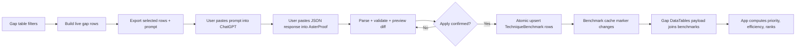

# Add Technique Gap Benchmark Import/Export

## Overview

Add a global curriculum benchmark layer to the existing technique progress gap dashboard. The app will export selected gap rows as a ChatGPT-ready prompt, accept pasted ChatGPT JSON back through a preview-before-apply workflow, store static benchmark metadata globally, and compute live training priority ranks from current completion data.

The feature must not embed an AI model or let ChatGPT decide live rank. ChatGPT classifies stable curriculum metadata; AsterProof computes priority dynamically from solved/total/remaining/coverage/MOHS and target profile.

## Problem Frame

The current gap table already shows area, completed count, remaining count, coverage, average solved MOHS, and practice links. It does not know whether a gap is syllabus-core, frequent in target contests, high-transfer, prerequisite-heavy, hard because of recognition burden, or best trained as drill versus deep work.

This feature adds that curriculum intelligence without changing the underlying completion model, statement catalog, or topic-tag normalization pipeline.

## Requirements Trace

- R1. Export current gap rows as strict machine-readable data plus a ChatGPT prompt.
- R2. Import ChatGPT output only through validation and preview; never apply unknown or invalid rows silently.
- R3. Store benchmark metadata globally, not per user, while keeping user progress dynamic.
- R4. Compute priority, efficiency, deep-work score, and ranks inside the app from live gap data.
- R5. Enrich the existing DataTables payload and CSV export with benchmark fields.
- R6. Keep benchmark editing admin-tool gated and preserve existing student access to read-only gap views.
- R7. Invalidate or naturally bust the 15-minute gap-row cache after benchmark changes.
- R8. Allow admins to restore benchmark values from an applied import batch.
- R9. Reject unsupported schema versions and enforce pasted-response, row-count, and text-field size limits.
- R10. Keep server-side ranking order correct: filter and score all matching rows before sorting, ranking, and pagination.

## Scope Boundaries

- Do not call OpenAI/ChatGPT or any model API from the app.
- Do not merge or rewrite actual problem topic tags based on benchmark aliases.
- Do not persist final live ranks in the database; ranks change with completion data and selected target profile.
- Do not create a separate UI framework; follow existing Inspinia/Bootstrap/DataTables patterns.

## Context & Research

### Relevant Code and Patterns

- `inspinia/pages/technique_progress.py` owns gap row construction, cache keys, DataTables payloads, CSV export, and the gap page context.
- `inspinia/templates/pages/technique-progress-gaps.html` renders the server-side DataTables gap table.
- `inspinia/pages/views.py` routes `technique_progress_gaps_view` through CSV, DataTables JSON, and normal HTML responses.
- `inspinia/pages/models.py` already has `TechniqueProgressFact`, `TechniqueProgressCatalogState`, and `UserProblemDifficultyRating`.
- `handle_summary_parser_view`, `HandleSummaryParserForm`, and `handle-summary-parser.html` provide the closest paste-preview-copy UX pattern.
- `problem_statement_metadata_view` provides the closest preview/apply admin tool pattern and import audit-event behavior.
- Tests for this app currently live primarily in `inspinia/pages/tests.py`; do not create `inspinia/pages/tests/` because `tests.py` already occupies that module name.

### External Benchmarking Assumptions

- Use Algebra, Number Theory, Geometry, and Combinatorics as the main olympiad curriculum buckets.
- Treat MOHS as a subjective calibration signal, not the final ranking rule.
- Use static benchmark scores for curriculum importance/difficulty and dynamic gap metrics for student priority.

## Key Technical Decisions

- **Global benchmark rows:** Store one shared benchmark per stable gap identity. Rationale: syllabus importance and difficulty are curriculum facts, while solved/remaining/coverage are user-specific and already live elsewhere.
- **Expanded benchmark kind set:** Use `canonical_subtopic`, `technique`, `object`, `method`, `lemma`, `proof_role`, and `parent_family` rather than one generic `topic_tag`. Rationale: the existing dashboard has layered gaps, and identical labels can appear in different layers.
- **Aliases are benchmark-only:** Add alias support for duplicate granularity and naming cleanup, but do not rewrite `ProblemTopicTechnique`, `StatementTopicTechnique`, or `TechniqueProgressFact` labels. Rationale: ranking should improve before risking tag taxonomy churn.
- **Importer validates against current known keys:** Reject unknown `row_key` values unless they match an existing benchmark/alias. Rationale: this blocks hallucinated ChatGPT rows while still allowing updates to stored benchmark metadata.
- **Ranks computed after filtering and before pagination:** DataTables should sort/search across all matching rows, with ranks assigned to the filtered row set before slicing. Rationale: rank must reflect what the user is currently looking at, not just the current page.
- **Cache marker via benchmark aggregates:** Add a benchmark cache marker using benchmark/alias count plus latest `updated_at`, and include target profile/filter inputs in the gap cache key. Rationale: successful imports should show immediately without flushing unrelated cache entries.
- **Import batches are reversible:** Store old and new row snapshots in the preview/apply payload so an admin can restore the previous benchmark values from a batch. Rationale: early ChatGPT benchmark imports will need tuning, and manually repairing dozens of rows is risky.
- **Schema versions are locked:** Accept only `technique-gap-benchmark-v1` unless implementation adds an explicit allow-list setting. Rationale: old importer code should not silently accept a future ChatGPT output contract.
- **Benchmark quality is computed, not assumed:** Use `missing`, `partial`, `complete`, and `needs_review` statuses. Rationale: an imported row with low confidence, a very wide MOHS band, or suspicious alias/family change should not look equally trustworthy.

## Open Questions

### Resolved During Planning

- Benchmark scope: use one global benchmark table, not per-user or named profile benchmark rows.
- AI integration boundary: use manual copy/paste to ChatGPT; no internal model integration.

### Deferred to Implementation

- Exact display density for all new columns on mobile: keep all payload fields, but implementation may hide lower-priority columns responsively if the table becomes too wide.
- Exact admin sidebar placement: prefer a utility link near Handle parser if the page is not reachable enough from the gap-table button.

## High-Level Technical Design

> This illustrates the intended approach and is directional guidance for review, not implementation specification. The implementing agent should treat it as context, not code to reproduce.

## Public Interfaces

- Add URL names:
  - `pages:technique_gap_benchmark`
  - optional JSON/download endpoints only if the main view becomes too broad: `pages:technique_gap_benchmark_export`, `pages:technique_gap_benchmark_import`
- Add query params to gap table/export where needed:
  - `target_profile`: `jbmo`, `national`, `imo_tst`
  - `benchmark_status`: `missing`, `partial`, `complete`, `needs_review`
  - `training_type`, `target_level`, `parent_family`
  - `priority_min`, `difficulty_max`, `efficiency_min`, `coverage_max`, `remaining_min`
- ChatGPT export/import schema version: `technique-gap-benchmark-v1`; the importer rejects any other schema version by default.
- Add an admin restore action for an applied batch, exposed either on the benchmark page or a dedicated route such as `pages:technique_gap_benchmark_restore`.
- Official row key shape: `<benchmark_kind>:<label_key>`, for example:
  - `canonical_subtopic:functional-equations`
  - `technique:substitutions`
  - `method:cauchy-schwarz`
  - `lemma:cauchy`

## Data Model

Add the following models in `inspinia/pages/models.py` and migration `0032_technique_benchmarking.py`.

- `TechniqueBenchmark`
  - `kind`: choices `canonical_subtopic`, `technique`, `object`, `method`, `lemma`, `proof_role`, `parent_family`
  - `label`, `label_key`, `normalized_label`
  - `parent_family`, `primary_area`, `area_labels`
  - importance components: `syllabus_core`, `contest_frequency`, `transfer_value`, `prerequisite_value`
  - difficulty components: `concept_load`, `recognition_burden`, `execution_load`, `proof_fragility`, `cross_topic_dependency`
  - stored computed static scores: `importance_score`, `difficulty_score`
  - MOHS calibration: `typical_mohs_min`, `typical_mohs_max`, `typical_mohs_center`
  - target profile weights: `jbmo_weight`, `national_weight`, `imo_tst_weight`
  - coaching metadata: `training_type`, `target_level`, `benchmark_confidence`, `rationale`, `pitfalls`, `recommended_sequence`
  - `source_version`, `imported_from_batch`, timestamps
  - unique constraint on `kind`, `label_key`
  - indexes on `kind,label_key`, `parent_family`, `primary_area`, `importance_score`, `difficulty_score`
  - numeric validation: component scores 1-5, MOHS band 0-60, profile weights positive decimals, confidence 0-100
- `TechniqueBenchmarkImportBatch`
  - `created_by` using `on_delete=PROTECT`, `status` with `PREVIEWED`, `APPLIED`, `FAILED`, `RESTORED`, `source`
  - `prompt_text`, `pasted_response`, `preview_payload`
  - `preview_payload.old_rows`: old benchmark snapshots keyed by row key before apply
  - `preview_payload.new_rows`: normalized imported benchmark snapshots keyed by row key
  - `preview_payload.invalid_rows`: rejected row summaries and validation messages
  - row counts: total, valid, invalid, created, updated, unchanged
  - `error_summary`, `created_at`, `applied_at`, optional `restored_at`
- `TechniqueBenchmarkAlias`
  - `kind`, `alias_label`, `alias_key`, FK to `TechniqueBenchmark`, `reason`, `created_at`
  - unique constraint on `kind`, `alias_key`

Register the models in `inspinia/pages/admin.py` with compact `list_display`, search on labels/family, and filters by kind, area, action, and target level.

## Import Limits

Enforce conservative limits before parsing and during row validation:

- pasted response: 2 MB maximum
- rows per import: 300 maximum
- `rationale`: 500 characters
- `pitfalls`: 500 characters
- `recommended_sequence`: 500 characters
- reject empty response and responses below a minimal useful size rather than attempting best-effort parsing

These limits apply to JSON, fenced JSON, JSONL, and TSV fallback imports.

## Scoring Rules

Implement deterministic scoring in `inspinia/pages/technique_benchmarking/scoring.py`.

- `importance_score = 0.30*syllabus_core + 0.25*contest_frequency + 0.20*transfer_value + 0.15*prerequisite_value + 0.10*target_weight`
- `difficulty_score = 0.25*concept_load + 0.25*recognition_burden + 0.20*execution_load + 0.15*proof_fragility + 0.15*cross_topic_dependency`
- `coverage_gap = 1 - completed / total`
- `volume_gap = log(remaining + 1) / log(max_remaining + 1)`
- `gap_pressure = 100 * (0.65*coverage_gap + 0.35*volume_gap)`
- `priority_score = gap_pressure * importance_score / 5`
- `efficiency_score = priority_score / difficulty_score`
- `deep_work_score = priority_score * difficulty_score / 5`

Target weight comes from the selected target profile:

- `jbmo` -> `jbmo_weight`
- `national` -> `national_weight`
- `imo_tst` -> `imo_tst_weight`
- missing/invalid -> `national`

Computed fallback action:

- priority >= 80 and difficulty <= 3: `Drill`
- priority >= 80 and difficulty > 3: `Deep block`
- priority >= 60 and efficiency >= 20: `Drill`
- priority >= 60: `Mixed mock`
- priority >= 40: `Review`
- otherwise: `Postpone`

Display both imported `training_type` and computed/final action when useful; default `final_training_type` to the computed action once enough benchmark data exists.

## Benchmark Quality Status

Compute `benchmark_status` for each gap row:

- `missing`: no benchmark row matched the row key or alias.
- `partial`: benchmark row exists but one or more required benchmark fields for scoring is blank.
- `complete`: benchmark row has all required fields and no review flags.
- `needs_review`: benchmark row is usable but has at least one review flag.

Review flags:

- `benchmark_confidence < 70`
- `typical_mohs_max - typical_mohs_min >= 25`
- parent family changed from the previous imported value in the latest batch
- alias lookup was needed and the alias reason or target is ambiguous

Rows with `needs_review` still participate in scoring, but the UI and CSV must clearly show the status.

## Implementation Units

- [ ] **Unit 1: Benchmark models and key normalization**

**Goal:** Add durable global benchmark storage and stable identity helpers.

**Requirements:** R2, R3, R7

**Files:**
- Modify: `inspinia/pages/models.py`
- Modify: `inspinia/pages/admin.py`
- Create: `inspinia/pages/migrations/0032_technique_benchmarking.py`
- Create: `inspinia/pages/technique_benchmarking/__init__.py`
- Create: `inspinia/pages/technique_benchmarking/keys.py`
- Test: `inspinia/pages/tests.py`

**Approach:**
- Implement `normalize_benchmark_key(label)` using NFKC normalization, lowercase, `& -> and`, non-alphanumeric collapse to `-`, and trim.
- Implement row-key helpers that map existing gap rows to benchmark kinds:
  - subtopic rows -> `canonical_subtopic`
  - technique rows -> `technique`
  - object/method/lemma/proof-role rows -> corresponding layer kind
- Preserve original labels and never overwrite current catalog labels based on ChatGPT text.
- Add model `save()` normalization for `label_key`, alias keys, and static score recomputation when all component fields are present.

**Patterns to follow:**
- Existing model normalization patterns in `ProblemTopicTechnique.save()` and `TechniqueProgressFact.save()`.
- Existing migration style under `inspinia/pages/migrations/0030_*` and `0031_*`.

**Test scenarios:**
- Happy path: `"FUNCTIONAL EQUATION"` normalizes to `functional-equation`.
- Happy path: `"UVW/SMOOTHING"` normalizes to `uvw-smoothing`.
- Happy path: model save fills blank `label_key` from label.
- Edge case: `&`, repeated punctuation, and whitespace normalize deterministically.
- Error path: duplicate `kind + label_key` violates uniqueness.
- Integration: alias lookup maps `coordinates` to an existing coordinate benchmark only when alias exists.

**Verification:**
- Benchmark models migrate cleanly and key helpers return stable row keys for existing gap row shapes.

- [ ] **Unit 2: Export payload and ChatGPT prompt builder**

**Goal:** Generate strict JSON and a copyable prompt from current gap rows.

**Requirements:** R1, R3, R4

**Files:**
- Create: `inspinia/pages/technique_benchmarking/export.py`
- Modify: `inspinia/pages/technique_progress.py`
- Test: `inspinia/pages/tests.py`

**Approach:**
- Reuse `_gap_rows_for_request` and existing filters as the source of truth for selected rows.
- Add export-only filters: coverage max, remaining min, missing benchmark only, include existing benchmark, target profile.
- Add global MOHS context to aggregate rows:
  - `avg_solved_mohs`
  - `available_mohs_min`, `available_mohs_max`, `available_mohs_avg` for all/remaining statements where available
  - `typical_mohs_band` from existing benchmark when present
- Export JSON object:
  - `schema_version`
  - `target_profile`
  - filter summary
  - scoring definitions
  - `rows[]` with `row_key`, kind, label, label_key, areas, completed, total, remaining, coverage, MOHS stats, tag context, existing benchmark if requested
- Generate prompt text requiring strict JSON array output, no row-key changes, no invented live gap numbers, and 1-5 score definitions.
- Provide JSON array and JSONL/CSV download payloads only if the UX needs them; otherwise the main page can expose copyable textareas.

**Patterns to follow:**
- Gap CSV export in `build_technique_progress_gaps_csv_response`.
- Handle parser copyable textarea UX.

**Test scenarios:**
- Happy path: filtered export includes all matching rows, not only the first DataTables page.
- Happy path: prompt contains exported row JSON and schema version.
- Happy path: existing benchmark is included only when requested.
- Edge case: empty export produces a valid payload with zero rows and a useful UI message.
- Security: export payload excludes private solution text and user post-mortem data.
- Permission: benchmark export page/action is admin-tool gated when `DEBUG=False`.

**Verification:**
- A copied prompt can be pasted into ChatGPT and the embedded row data is strict parseable JSON.

- [ ] **Unit 3: Import parser, validation, and preview diff**

**Goal:** Parse pasted ChatGPT output, validate it strictly, and show old-vs-new changes before applying.

**Requirements:** R2, R3, R6, R9

**Files:**
- Create: `inspinia/pages/technique_benchmarking/importing.py`
- Modify: `inspinia/pages/forms.py`
- Test: `inspinia/pages/tests.py`

**Approach:**
- Add `TechniqueBenchmarkImportForm` with `prompt_text`, `pasted_response`, optional `target_profile`, and hidden/textarea export context when present.
- Reject pasted responses above 2 MB before parsing and reject parsed imports above 300 rows.
- Parser accepts, in order:
  - strict JSON array
  - JSON object with `rows`
  - fenced JSON block
  - JSONL
  - TSV fallback with exact headers
- Validate each row:
  - `schema_version` must equal `technique-gap-benchmark-v1`; reject unknown future versions such as `technique-gap-benchmark-v2`
  - required `row_key`, known key, no duplicate row key
  - known-key registry comes from the exported context when present; otherwise use current catalog gap keys plus existing benchmark and alias keys
  - score components are integers 1-5
  - MOHS min/max are 0-60 and min <= max
  - weights are positive decimals in a conservative range, defaulting to 1.00 if absent
  - valid `training_type`: `Drill`, `Deep block`, `Mixed mock`, `Review`, `Postpone`
  - valid `target_level`: `Foundation`, `JBMO`, `National`, `IMO/TST`, `Specialist`
  - non-empty `parent_family` and `rationale`
  - `rationale`, `pitfalls`, and `recommended_sequence` fit the 500-character limits
- Emit warnings rather than errors for low confidence, wide MOHS band, large label drift, and changed parent family.
- Build preview rows with status: `new`, `changed`, `unchanged`, `error`, plus field-level old/new changes.
- Preview may contain both valid and invalid rows. The apply action must be labeled "Apply valid rows" and must ignore invalid rows; if the user needs all-or-nothing, they can fix the invalid rows and preview again.

**Patterns to follow:**
- `HandleSummaryParserForm` and parser validation style.
- `problem_statement_metadata_view` preview/apply separation.

**Test scenarios:**
- Happy path: strict JSON array parses into preview rows.
- Happy path: fenced JSON and JSONL parse.
- Error path: malformed JSON, unsupported schema version, oversized response, too many rows, duplicate row key, unknown row key, score 6, reversed MOHS range, bad action, empty rationale, overlong rationale/pitfalls/sequence.
- Edge case: partial batch with valid and invalid rows previews both categories and applies only valid rows when the explicit "Apply valid rows" action is submitted.
- Integration: preview does not mutate `TechniqueBenchmark`.

**Verification:**
- Admin can paste ChatGPT JSON and see a deterministic diff table without database changes.

- [ ] **Unit 4: Transactional import apply, restore, and audit history**

**Goal:** Commit valid benchmark rows safely, retain reversible batch history, support admin restore, and refresh cached gap data.

**Requirements:** R2, R3, R6, R7, R8

**Files:**
- Modify: `inspinia/pages/technique_benchmarking/importing.py`
- Modify: `inspinia/pages/views.py`
- Modify: `inspinia/pages/urls.py`
- Test: `inspinia/pages/tests.py`

**Approach:**
- Apply imports inside `transaction.atomic()`.
- Create `TechniqueBenchmarkImportBatch` on preview with status `PREVIEWED`, prompt text, pasted response, counts, `preview_payload.old_rows`, `preview_payload.new_rows`, and `preview_payload.invalid_rows`.
- On apply, revalidate the submitted response or preview batch payload, apply only valid rows inside `transaction.atomic()`, then mark the batch `APPLIED`; failed applies mark a batch `FAILED` with `error_summary`.
- Treat the apply operation as atomic for the selected valid rows: either all selected valid rows are written, or none are written.
- Add an admin-only restore action: "Restore previous values from this batch".
- Restore reads `preview_payload.old_rows` and `preview_payload.new_rows`, reverses changed rows inside `transaction.atomic()`, marks the batch `RESTORED`, and updates/restores/deletes benchmark rows according to the saved old snapshot.
- Use `update_or_create()` by `kind + label_key`, but compare normalized payload first so unchanged rows do not churn timestamps.
- Store `imported_from_batch` on changed rows.
- Recompute `importance_score`, `difficulty_score`, and `typical_mohs_center` on import.
- Record existing `AuditEvent.EventType.IMPORT_COMPLETED` / `IMPORT_FAILED` events with benchmark-specific metadata.
- Make the benchmark cache marker change through benchmark/alias updated timestamps; do not manually clear unrelated cache keys.

**Patterns to follow:**
- `_apply_statement_metadata_import` for messages and audit events.
- Existing `_gap_rows_cache_key` marker design.

**Test scenarios:**
- Happy path: valid batch creates benchmarks and import batch counts.
- Happy path: existing benchmark updates and unchanged rows count correctly.
- Error path: an exception during valid-row apply rolls back all rows in that apply transaction.
- Edge case: mixed valid/invalid preview applies valid rows only and records rejected row count on the batch.
- Happy path: restore from an applied batch reverts changed benchmarks to `old_rows`.
- Edge case: restore deletes a benchmark that was newly created by the batch and had no old row snapshot.
- Error path: restore failure rolls back the full restore operation.
- Permission: non-admin is forbidden when `DEBUG=False`.
- Integration: successful import changes the benchmark cache marker and the next DataTables payload includes new scores.

**Verification:**
- Applying a previewed import is atomic and immediately reflected in the gap table.

- [ ] **Unit 5: Benchmark management UI**

**Goal:** Provide an admin-tool page for export, prompt copy, response paste, preview, and apply.

**Requirements:** R1, R2, R6

**Files:**
- Create: `inspinia/templates/pages/technique-gap-benchmark.html`
- Modify: `inspinia/pages/views.py`
- Modify: `inspinia/pages/urls.py`
- Optionally modify: `inspinia/templates/partials/sidenav.html`
- Test: `inspinia/pages/tests.py`

**Approach:**
- Add a dashboard page extending `layouts/vertical.html`.
- Page sections:
  - export filters and target profile
  - copyable generated prompt textarea
  - copyable JSON-only textarea
  - current exported rows preview
  - pasted ChatGPT response textarea
  - preview diff table
  - apply valid rows button with confirmation state
  - batch history/restore affordance for recent applied batches
- Preserve current filter query params when arriving from `technique-progress-gaps.html`.
- Use Tabler icons and existing card/table/button styles.
- Keep page-local JS only for copy/clear behavior, modeled after `handle-summary-parser.html`.

**Patterns to follow:**
- `handle-summary-parser.html` copy/clear UI.
- `problem-statement-metadata.html` preview/apply admin UX.
- `docs/inspinia-dashboard-style.md`.

**Test scenarios:**
- Happy path: admin can open benchmark page from current gap filters.
- Happy path: export prompt and JSON textareas render with schema version and row count.
- Happy path: preview displays changed/new/error rows.
- Happy path: applied batch exposes an admin restore button and restored batch no longer presents as an unapplied import.
- Permission: normal approved user cannot access mutation page in production access mode.
- UI: page includes expected copy/preview/apply controls and no raw gap rows are duplicated into the main gap template.

**Verification:**
- Admin workflow is: gap table -> Benchmark gaps -> copy prompt -> paste response -> preview -> apply -> return to gap table.

- [ ] **Unit 6: Enrich gap DataTables payload, filters, sorting, and CSV**

**Goal:** Show benchmark intelligence beside existing gap metrics and sort by dynamic priority.

**Requirements:** R4, R5, R7, R10

**Files:**
- Modify: `inspinia/pages/technique_progress.py`
- Modify: `inspinia/templates/pages/technique-progress-gaps.html`
- Test: `inspinia/pages/tests.py`

**Approach:**
- Build a benchmark lookup for all visible row keys after gap rows are built.
- Resolve aliases only for benchmark lookup; do not alter the live row label.
- Enrich each row with:
  - `benchmark_status`: `missing`, `partial`, `complete`, `needs_review`
  - static fields: parent family, primary area, target level, training type, typical MOHS band, confidence, rationale
  - components: syllabus core, contest frequency, transfer value, prerequisite value, difficulty components
  - computed fields: importance score, difficulty score, gap pressure, priority score, efficiency score, deep-work score, computed/final training type
  - ranks: priority rank, importance rank, difficulty rank
- Apply server-side DataTables operations in this non-negotiable order:
  - build all matching gap rows
  - join benchmark/alias metadata
  - apply search and benchmark filters
  - compute scores against the filtered row set
  - sort
  - assign ranks
  - paginate
  - return JSON
- Add sort fields for rank, priority, efficiency, gap pressure, importance, difficulty, action, parent family, confidence.
- Default sort to priority descending once benchmark fields are available; keep existing remaining-desc behavior for fully unbenchmarked data if needed.
- Extend CSV field names with rank/priority/efficiency/gap pressure/importance/difficulty/family/action/MOHS band/confidence/rationale.

**Visible columns:**
- Rank
- Priority
- Efficiency
- Gap pressure
- Importance
- Difficulty
- Parent family
- Action
- MOHS band
- Confidence

**Patterns to follow:**
- Existing server-side DataTables implementation and render functions in `technique-progress-gaps.html`.
- Existing CSV row builder `_gap_csv_row`.

**Test scenarios:**
- Happy path: DataTables JSON includes all benchmark fields.
- Happy path: rows rank by priority across all matching filtered rows before pagination.
- Error guard: test proves rank is not recomputed per page by requesting a second DataTables page after sorting.
- Happy path: CSV includes benchmark columns.
- Edge case: missing benchmark rows render placeholders and `benchmark_status = missing`.
- Edge case: low confidence, wide MOHS band, changed parent family, or ambiguous alias yields `benchmark_status = needs_review`.
- Edge case: missing required scoring fields yields `benchmark_status = partial`.
- Edge case: `difficulty_score = 0` cannot occur; missing difficulty yields blank efficiency rather than division failure.
- Integration: existing filters by kind/topic/min_total/canonical_subtopic continue to work.
- Integration: search finds parent family, action, target level, and rationale.

**Verification:**
- Existing gap behavior remains intact, with benchmark fields available for sorting, filtering, and export.

- [ ] **Unit 7: Documentation, seed workflow, and regression coverage**

**Goal:** Make the manual ChatGPT workflow repeatable and safe.

**Requirements:** R1-R7

**Files:**
- Modify: `README.md` or create `docs/technique-gap-benchmarking.md`
- Modify: `inspinia/pages/tests.py`

**Approach:**
- Add a golden benchmark fixture under `inspinia/pages/testdata/`, for example `technique_benchmark_golden_v1.json`.
- Include eight representative rows: `PARITY`, `PIGEONHOLE`, `FACTORISATION`, `CAUCHY`, `FUNCTIONAL EQUATION`, `TANGENCY`, `VALUATIONS`, `EXPONENTIAL DIOPHANTINE`.
- Manually define expected benchmark values for the golden rows and use them as the regression anchor for parser, preview, apply, scoring, DataTables, and CSV tests.
- Document the first recommended import batches:
  - foundation debt: parity, pigeonhole, factorization, residues, bounding, Cauchy, substitutions, equality case, recurrence
  - large parent families: inequalities, polynomials, functional equations, sequences, algebraic structures, equations/substitutions
  - geometry core: tangency, similarity, reflections, coordinates, coordinate geometry, collinearity, projections
  - advanced hard topics: valuations, exponential Diophantine, convexity, smoothing, UVW, extremal, periodicity, floor functions/sums, interpolation, density
- Document that ChatGPT output is static curriculum metadata and live rank is app-computed.
- Add regression coverage near existing technique progress tests in `inspinia/pages/tests.py`.

**Test scenarios:**
- Golden fixture: import -> preview -> apply -> DataTables score -> CSV export passes for the eight representative rows.
- Full admin smoke flow: export -> preview valid response -> apply -> DataTables row shows priority rank.
- Existing technique progress tests still pass without benchmark rows.
- Permission smoke: students can view enriched gap table but cannot open/apply benchmark import.

**Verification:**
- A future maintainer can run the workflow without reading this plan.

## System-Wide Impact

- **Database:** Adds three small benchmark tables. No existing rows require data migration/backfill.
- **Gap cache:** Existing gap cache key must include benchmark marker and target profile/filter params. The marker must include `benchmark_count`, `alias_count`, `latest_benchmark_updated_at`, and `latest_alias_updated_at`.
- **Permissions:** Benchmark export/import is admin-tool gated. Read-only enriched fields can appear to normal users.
- **Audit:** Reuse import audit event types with benchmark-specific metadata rather than adding a new audit event enum unless implementation finds that necessary.
- **Performance:** Benchmark lookup should bulk-fetch by row keys, not query per row. DataTables still builds rows in memory as the current implementation does.
- **Compatibility:** Existing CSV columns remain and new benchmark columns append after current fields.
- **Restore lifecycle:** Restoring a batch mutates benchmark rows and therefore must update the benchmark cache marker and write an audit event.
- **Invariants:** Do not alter `ProblemSolveRecord.topic_tags`, `ProblemTopicTechnique`, `StatementTopicTechnique`, or `TechniqueProgressFact` normalization from this feature.

## Risks & Mitigations

| Risk | Mitigation |
|------|------------|
| ChatGPT returns malformed or hallucinated rows | Strict parser, known-key validation, preview errors, no silent apply |
| ChatGPT output shape changes later | Schema version lock accepts only `technique-gap-benchmark-v1` by default |
| Huge pasted content stresses parser or UI | Enforce 2 MB response limit, 300-row limit, and 500-character text field limits |
| Same label means different things in different layers | Expanded benchmark kind set and layer-aware row keys |
| Benchmark import appears stale due to cached gap rows | Add benchmark aggregate marker to gap cache key |
| Bad first benchmark import affects many rows | Store old/new row snapshots and provide admin restore from batch |
| Rank becomes misleading if stored permanently | Compute rank live from current gap rows and target profile |
| Rank is wrong in server-side DataTables mode | Build/filter/score/sort/rank all matching rows before pagination |
| UI table becomes too wide | Keep all fields in payload/CSV, use compact rendering and responsive hiding only as display detail |
| Alias mapping accidentally changes taxonomy | Alias lookup affects benchmark join only; no topic-tag rewrite |
| Partial import corrupts benchmark state | Use `transaction.atomic()` and apply only validated rows |

## Acceptance Criteria

- Current filtered gaps can be exported as strict JSON and a ChatGPT-ready prompt.
- Pasted ChatGPT output previews as a diff table before any mutation.
- Importer rejects unsupported schema versions, including `technique-gap-benchmark-v2`.
- Importer enforces pasted response, row count, and long-text field limits.
- Unknown row keys and invalid scores/actions/MOHS ranges are rejected.
- Applying valid rows creates/updates global benchmark metadata transactionally.
- Applied import batches store `old_rows` and `new_rows`, and admins can restore previous values from a batch.
- Gap DataTables payload includes benchmark status (`missing`, `partial`, `complete`, `needs_review`), importance, difficulty, priority, efficiency, deep-work, ranks, action, MOHS band, and confidence.
- Sorting by priority rank works across all matching rows, with ranks assigned after filtering/sorting and before pagination.
- Golden benchmark fixture covers the eight representative topics through import, preview, apply, DataTables, and CSV export.
- CSV export includes benchmark and rank fields.
- Completing more problems changes priority/rank without reimporting benchmark metadata.
- Benchmark/alias count and latest update timestamps are included in the gap cache marker so imports/restores refresh immediately.
- Benchmark import is unavailable to non-admin users when admin-tool access is enforced.
- Existing technique progress and gap tests continue passing without benchmark data.

## Validation

- Run focused technique progress and benchmark tests in `inspinia/pages/tests.py`.
- Run `uv run pytest inspinia/pages/tests.py`.
- Run `uv run ruff check config inspinia`.
- Run `uv run python manage.py check`.

## Sources & References

- Project guidance: `AGENTS.md`, `inspinia/AGENTS.md`, `inspinia/pages/AGENTS.md`, `inspinia/templates/AGENTS.md`
- UI guidance: `docs/inspinia-dashboard-style.md`
- Existing gap implementation: `inspinia/pages/technique_progress.py`
- Existing gap template: `inspinia/templates/pages/technique-progress-gaps.html`
- Existing paste-preview reference: `inspinia/pages/handle_summary_parser.py`, `inspinia/templates/pages/handle-summary-parser.html`
- Existing admin import reference: `inspinia/pages/views.py` statement metadata import flow
